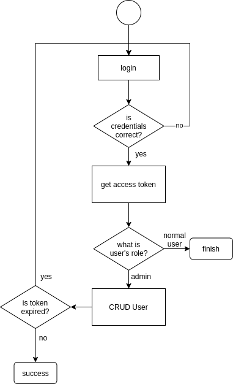

# Userlogin

This repository is used for CRUD User and login

## Project setup

1. Clone this repo to go/src/github.com/bramsedana

2. Install dependencies

```
npm install
```

3. Start project

```
node run app.js
```

## Testing the application

To test the application, there is a blueprint for all the API in folder `blueprint` that can be imported to postman 

## User example

This application uses an online database with two users already created for testing

```
Username: admin
Password: adminpwd
Role: admin
```

```
Username: user\
Password: userpwd\
Role: normal user
```

## Application flow

# 
